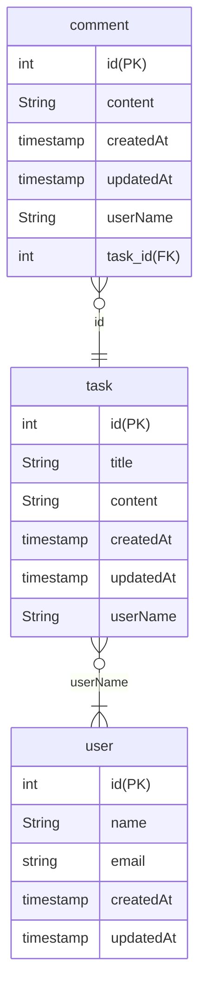

# 일정 관리 앱 프로젝트

#### 목표

- JPA와 3 Layer Architecture을 통해 CRUD 구축과 JWT를 활용해 인증/인가 절차 개발

#### 기본 요구 사항

- 모든 테이블은 고유 식별자(ID)을 가진다
- 3 Layer Architecture에 따라 각 Layer의 목적에 맞게 개발
- CRUD 필수 기능은 모두 데이터베이스 연결 및 JPA를 사용해서 개발
- JDBC와 Spring Security는 사용하지 않는다
- 인증/인가 절차는 JWT를 활용하여 개발
- JPA의 연관관계는 양방향으로 구현

## API 설계

## 일정 API
### 일정 등록

- Method : POST
- URL : /api/task
- Request Body :
  { "title": String ,"content": String,"userName": String
  }
- Response : {
  "id": Long,
  "title": String,
  "content": String,
  "userName": String,
  "createdAt": Timestemp,
  "updatedAt": Timestemp,
  "comments": List<comment>
  }

### 일정 전체 조회

- Method : GET
- URL : /api/task
- Response : List<Task> ({
  "id": Long,
  "title": String,
  "content": String,
  "userName": String,
  "createdAt": Timestemp,
  "updatedAt": Timestemp,
  "comments": List<comment>
  }, ...)

### 일정 선택 조회

- Method : GET
- URL : /api/task/{id}
- Request Body : {"id" : Long }
- Response : Task {
  "id": Long,
  "title": String,
  "content": String,
  "userName": String,
  "createdAt": Timestemp,
  "updatedAt": Timestemp,
  "comments": List<comment>
  }

### 일정 수정 조회

- Method : PUT
- URL : /api/task/{id}
  - Request Body : {
  "id" : Long ,  
  "title": String,
  "content": String,
  "userName": String
  }
- Response : 200 code

### 일정 삭제 조회

- Method : DELETE
- URL : /api/task/{id}
    - Request Body : {
      "id" : Long
      }
- Response : 200 code

## 댓글 API
### 댓글 등록

- Method : POST
- URL : /api/task/comment
- Request Body :
  { "taskId": Long ,"content": String,"userName": String
  }
- Response : {
  "id": Long,
  "taskId": Long,
  "content": String,
  "userName": String,
  "createdAt": Timestemp,
  "updatedAt": Timestemp,
  }

### 댓글 전체 조회

- Method : GET
- URL : /api/task/comment
- Response : List<comment> ({
  "id": Long,
  "taskId": Long,
  "content": String,
  "userName": String,
  "createdAt": Timestemp,
  "updatedAt": Timestemp,
  }, ...)

### 댓글 선택 조회

- Method : GET
- URL : /api/task/comment/{id}
- Request Body : {"id" : Long }
- Response : comment {
  "id": Long,
  "taskId": Long,
  "content": String,
  "userName": String,
  "createdAt": Timestemp,
  "updatedAt": Timestemp,
  }

### 댓글 수정 조회

- Method : PUT
- URL : /api/task/comment/{id}
    - Request Body : {
      "id" : Long ,  
      "taskId": Long,
      "content": String,
      "userName": String
      }
- Response : 200 code

### 댓글 삭제 조회

- Method : DELETE
- URL : /api/task/comment/{id}
    - Request Body : {
      "id" : Long
      }
- Response : 200 code

## ERD

## 요구 사항

### 필수 요구사항

### Lv 1. API 명세 및 ERD 작성

- API 명세서 작성하기
    - API명세서는 프로젝트 root(최상위) 경로의 README.md 에 작성
- ERD 작성하기
    - ERD는 프로젝트 root(최상위) 경로의 README.md 에 첨부
- SQL 작성하기
    - 설치한 데이터베이스(Mysql)에 ERD를 따라 테이블을 생성

### Lv 2. 일정 CRUD

- 일정을 저장, 조회, 수정, 삭제할 수 있다
- 필드 : 작성 유저명, 할일 제목, 할일 내용, 작성일, 수정일
- 삭제의 경우
    - 일정을 삭제할 때 일정의 댓글도 함께 삭제
    - JPA의 영속성 전이 기능을 활용해 삭제

- 키워드
    - 어노테이션
        - `@Entity`: 데이터베이스 테이블과 매핑되는 클래스에 사용
        - `@Id`: 해당 필드를 기본 키로 지정
        - `@GeneratedValue`: 기본 키 생성 전략을 설정
        - `@Repository`: DAO(Data Access Object) 클래스에 사용하여 데이터 접근을 명시

### Lv 3. 댓글 CRUD

- 생성한 일정에 댓글을 남길 수 있다
    - 댓글과 일정은 연관관계를 가진다(`N 대 1 관계`)
- 댓글을 저장, 조회, 수정, 삭제할 수 있다
- 필드 : 댓글 내용, 작성일, 수정일, 작성 유저명

- 키워드
    - 어노테이션
        - `@Entity`: 데이터베이스 테이블과 매핑되는 클래스에 사용
        - `@Id`: 해당 필드를 기본 키로 지정
        - `@GeneratedValue`: 기본 키 생성 전략을 설정
        - `@Repository`: DAO(Data Access Object) 클래스에 사용하여 데이터 접근을 명시
        - `@ManyToOne`: 일정 엔티티와 댓글 엔티티간의 연간관계를 설정

### Lv 4. 일정 페이징 조회

- 일정을 Spring Data JPA의 `Pageable`과 `Page 인터페이스`를 활용하여 페이지네이션을 구현
    - 페이지 번호와 페이지 크기를 쿼리 파라미터로 전달하여 요청하는 항목을 나타낸다
    - 할일 제목, 할일 내용, 댓글 개수, 일정 작성일, 일정 수정일, 일정 작성 유저명 필드를 조회
    - 디폴트 페이지 크기는 10으로 적용
- 일정의 수정일을 기준으로 내림차순 정렬

- 키워드
    - 데이터베이스
        - `offset / limit` : SELECT 쿼리에 적용해서 데이터를 제한 범위에 맞게 조회할 수 있다
    - 페이징
        - `Pageable`: Spring Data JPA에서 제공되는 페이징 관련 인터페이스
        - `PageRequest`: Spring Data JPA에서 제공되는 페이지 요청 관련 클래스

### Lv 5. 유저 CRUD

- 유저를 저장, 조회, 삭제할 수 있다
- 필드 : 유저명, 이메일, 작성일, 수정일
- 일정은 작성 유저명 필드 대신 유저 고유 식별자 필드를 가진다
- 일정을 작성한 유저는 추가로 일정 담당 유저들을 배치 가능
    - 유저와 일정은 (`N 대 M 관계`)
    - JPA 지연로딩을 활용

- 키워드
    - 어노테이션
        - `@Entity`: 데이터베이스 테이블과 매핑되는 클래스에 사용
        - `@Id`: 해당 필드를 기본 키로 지정
        - `@GeneratedValue`: 기본 키 생성 전략을 설정
        - `@Repository`: DAO(Data Access Object) 클래스에 사용하여 데이터 접근을 명시
        - `@ManyToOne`: 유저 테이블과 일정 테이블간 연간관계를 설정
        - `@OneToMany`: 유저 테이블과 일정 테이블간 연간관계를 설정
        - `지연로딩`: 객체가 조회될 때 연관된 객체를 한번에 조회 하지 않는다

### Lv 6. 다양한 예외처리 적용하기

- validation을 활용해 다양한 예외처리를 적용
- 정해진 예외처리 항목이 있는것이 아닌 프로젝트를 분석하고 예외사항을 지정
    - `@Pattern`을 사용해서 회원 가입 Email 데이터 검증
        - 정규표현식을 적용하되, 정규표현식을 어떻게 쓰는지 몰두
        - 검색해서 나오는 것을 적용하는 것으로 충분
    - 할일 제목은 10글자 이내, 유저명은 4글자 이내

- 키워드
    - 어노테이션
        - `@Valid`: 객체의 제약 조건을 검증
        - 아래 다양한 어노테이션을 최대한 활용
            - `@NotNull`: null 불가
            - `@NotEmpty`: null, ""불가
            - `@NotBlank`: null, "".""불가
            - `@Size`: 문자 길이 측정
            - `@Max`: 최댓값
            - `@Min`: 최솟값
            - `@Positive`: 양수
            - `@Negative`: 음수
            - `@Email`: E-mail 형식
            - `@Pattern`: 정규 표현식

### 도전 요구사항

### Lv 1. 회원가입(JWT)

- 유저에 비밀번호 필드를 추가
    - 비밀번호는 암호화
    - 암호화를 위한 PasswordEncoder를 직접 만들어 사용
- 유저 최초 생성(회원가입) 시 JWT를 발급 후 반환

### Lv 2. 로그인(인증)

- 설명
    - JWT를 활용해 로그인 기능을 구현(필터)
    - 필터를 활용해 인증 처리 가능
- 조건
    - 이메일과 비밀번호를 활용해 로그인 기능을 구현
        - 로그인 성공 시 JWT 발급 후 반환
    - 모든 요청에서 토큰을 활용하여 인증 처리
        - 토큰은 Header에 추가
    - 회원가입과 로그인은 인증 처리에서 제외
- 예외처리
    - 로그인 시 이메일과 비밀번호가 일치하지 않을 경우 코드 401을 반환
    - 토큰이 없는 경우 코드 400을 반환
    - 유효 기간이 만료된 토큰의 경우 코드 401을 반환

- 키워드
    - 인터페이스
        - `HttpServletRequest / HttpServletResponse` : 각 HTTP 요청에서 주고받는 값들을 담고 있다

### Lv 3. 권한 확인(인가)

- 조건
    - 유저에 권한을 추가
    - 일정 수정 및 삭제는 관리자 권한이 있는 유저만 가능
- 예외처리
    - 권한이 없는 유저의 경우 403을 반환
      (권한이 없는 유저가 일정 수정 및 삭제를 요청했을 때)

- 키워드
    - JWT
        - `Claim / payload` :  JWT 내부에 정보를 저장할 수 있는 공간
    - Filter
        - `Filter` :  요청이 전달되기 전/후에 url 패턴에 맞는 모든 요청에 대해 부가작업을 처리

### Lv 4. 외부 API 조회

- 조건
    - 날씨 정보 데이터(링크) API를 활용하여 오늘의 날씨를 조회 가능
        - RestTemplate을 사용해 날씨를 조회
    - 일정에 날씨 필드를 추가
        - 일정 생성 시에 날씨 정보를 생성일 기준으로 저장 가능

- 키워드
    - 외부 API 연동
        - `RestTemplate / WebClient` :  외부 API와 연동을 위한 Spring 제공 클래스

## 예외처리

- `@Pattern`을 사용해서 회원 가입 Email 데이터 검증
- 할일 제목은 10글자 이내, 유저명은 4글자
- 로그인 시 이메일과 비밀번호가 일치하지 않을 경우 401을 반환
- 토큰이 없는 경우 400을 반환
- 유효 기간이 만료된 토큰의 경우 401을 반환
- 권한이 없는 유저의 경우 403을 반환합니다
-

## 평가

- 최종 제출 : 10/17 (목) 14:00
- 완성도 : 필수(Lv 1, 2, 3, 4, 5, 6기능) / 도전(Lv 1, 2, 3, 4기능)
- 이해도 : 필수(트러블 슈팅 기록) / 도전(파일 분리, 직관적이고 이해 쉽게 코드 작성, 주석을 통한 코드 설명)
- 우수성 : 필수(ReadMe 작성) / 도전(특수 상황의 예외처리 2개이상 구현, 커밋 10회 이상 실행 )

