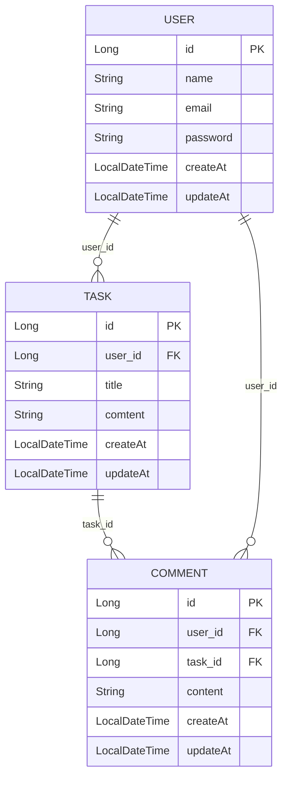

# 일정 관리 앱 프로젝트

#### 목표

- Spring을 사용해 프론트 엔드와 백 엔드로 일정을 관리하는 앱 만들기( C R U D )

#### 기본 요구 사항

- 일정 작성, 수정, 조회 시 반환 받은 일정 정보에 비밀번호는 제외
- 비밀번호가 일치하지 않을 경우 적절한 오류 코드 및 메세지를 반환
- 3 Layer Architecture 에 따라 각 Layer의 목적에 맞게 개발
- CRUD 필수 기능은 모두 데이터베이스 연결 및 JDBC 를 사용해서 개발

## API 명세표

<table>
    <tr>
        <th>API&nbsp;&nbsp;&nbsp;&nbsp;&nbsp;&nbsp;&nbsp;&nbsp;&nbsp;&nbsp;&nbsp;&nbsp;</th>
        <th>Method</th>
        <th>EndPoint</th>
        <th>Request</th>
        <th>Request Type</th>
        <th>Response</th>
        <th>Response Type</th>
        <th>Status</th>
    </tr>
    <tr>
      <td>회원 생성</td>
      <td>POST</td>
      <td><code>/api/scheduler</code></td>
      <td><pre lang="json">{
	  "name": "테스트 이름 1",
      "email": "xptmxm123@xptmxm.xtx",
      "password" : "a2345678"
      }</pre></td>
       <td><code>application/json</code></td>
      <td><pre lang="json">{
      "state": 200
      }</pre></td>
      <td><code>application/json</code></td>
      <td>200</td>
    </tr>
    <tr>
      <td>모든 회원 정보 조회</td>
      <td>GET</td>
      <td><code>/api/scheduler/userList</code></td>
      <td><code>N/A</code></td>
      <td><code>N/A</code></td>
      <td><pre lang="json"> 
      "UserList":{
        "id": 1,
        "name": "테스트 이름 1",
        "email": "xptmxm123@xptmxm.xtx",
        "password": "a2345678",
        "createdAt": "2024-10-29T12:14:07.40104",
        "updatedAt": "2024-10-29T12:14:07.40104"
      },
      "status":{
      "state": 200
      }</pre></td>
      <td><code>application/json</code></td>
      <td>200</td>
    </tr>
   <tr>
      <td>회원 정보 조회</td>
      <td>GET</td>
      <td><code>/api/scheduler/userId={userId}</code></td>
<td><code>N/A</code></td>
      <td><code>PathVariable</code></td>
      <td><pre lang="json">{
    "id": 1,
    "name": "테스트 이름 1",
    "email": "xptmxm123@xptmxm.xtx",
    "password": "a2345678",
    "createdAt": "2024-10-29T12:14:07.40104",
    "updatedAt": "2024-10-29T12:14:07.40104"
}, "status":{
      "state": 200
      }</pre></td>
      <td><code>application/json</code></td>
      <td>200</td>
   </tr>
       <tr>
      <td>회원 정보 수정</td>
      <td>PUT</td>
      <td><code>/api/scheduler/userId={userId}</code></td>
      <td><pre lang="json">{
	"name": "테스트 수정 이름 1",
    "email": "tnwjd134@xptmxm.xtx",
    "password" : "876a16543",
}</pre></td>
       <td><code>application/json</code></td>
      <td><pre lang="json">
"User"{
    "id": 1,
    "name": "테스트 수정 이름 1",
    "email": "tnwjd134@naver.com",
    "password": "876a16543",
    "createdAt": "2024-10-29T12:14:07.40104",
    "updatedAt": "2024-10-29T12:14:07.40104"
}
}, "status":{
      "state": 200
      }</pre></td>
      <td><code>application/json</code></td>
      <td>200</td>
    </tr>
    <tr>
      <td>회원 정보 삭제</td>
      <td>DELETE</td>
      <td><code>/api/scheduler/userId={userId}</code></td>
      <td><code>N/A</code></td>
       <td><code>PathVariable</code></td>
      <td><code>N/A</code></td>
      <td><code>N/A</code></td>
      <td>204</td>
    </tr>
<tr>
      <td>일정 생성</td>
      <td>POST</td>
      <td><code>/api/scheduler/userId={userId}</code></td>
      <td><pre lang="json">{
	"name": "테스트 이름 1",
    "title": "테스트 제목 1",
    "content": "테스트 내용 1"
      }</pre></td>
       <td><code>application/json</code></td>
      <td><pre lang="json">{
      "state": 200
      }</pre></td>
      <td><code>application/json</code></td>
      <td>200</td>
    </tr>
    <tr>
      <td>모든 회원 정보 조회</td>
      <td>GET</td>
      <td><code>/api/scheduler/userId={userId}/taskList</code></td>
      <td><code>N/A</code></td>
      <td><code>N/A</code></td>
      <td><pre lang="json"> 
     "TaskList"{
    "id": 1,
    "userId": 1,
    "title": "테스트 제목 1",
    "content": "테스트 내용 1",
    "comments": [
        {
            "id": 1,
            "userId": 1,
            "content": "테스트 내용 1",
            "taskId": 1,
            "createdAt": "2024-10-29T12:25:46.913566",
            "updatedAt": "2024-10-29T12:25:46.913566"
        }],
    "createdAt": "2024-10-29T12:16:43.72947",
    "updatedAt": "2024-10-29T12:16:43.72947"
}, "status":{
      "state": 200
      }</pre></td>
      <td><code>application/json</code></td>
      <td>200</td>
    </tr>
   <tr>
      <td>일정 정보 조회</td>
      <td>GET</td>
      <td><code>/api/scheduler/userId={userId}/taskId={id}</code></td>
      <td><code>N/A</code></td>
      <td><code>PathVariable</code></td>
      <td><pre lang="json">{
    "id": 1,
    "userId": 1,
    "title": "테스트 제목 1",
    "content": "테스트 내용 1",
    "comments": [
        {
            "id": 1,
            "userId": 1,
            "content": "테스트 내용 1",
            "taskId": 1,
            "createdAt": "2024-10-29T12:25:46.913566",
            "updatedAt": "2024-10-29T12:25:46.913566"
        }],
    "createdAt": "2024-10-29T12:16:43.72947",
    "updatedAt": "2024-10-29T12:16:43.72947"
}, "status":{
      "state": 200
      }</pre></td>
      <td><code>application/json</code></td>
      <td>200</td>
   </tr>
       <tr>
      <td>일정 정보 수정</td>
      <td>PUT</td>
      <td><code>/api/scheduler/userId={userId}/taskId={id}</code></td>
      <td><pre lang="json">{
	"name": "테스트 이름 수정 1",
    "title" : "테스트 제목 수정 1",
    "content" : "테스트 내용 수정 1"
}</pre></td>
       <td><code>application/json</code></td>
      <td><pre lang="json">
"Task"{
    "id": 2,
    "userId": 1,
    "title": "테스트 제목 수정 1",
    "content": "테스트 내용 수정 1",
    "comments": [],
    "createdAt": "2024-10-29T12:16:46.415083",
    "updatedAt": "2024-10-29T12:22:38.172127"
}
}, "status":{
      "state": 200
      }</pre></td>
      <td><code>application/json</code></td>
      <td>200</td>
    </tr>
    <tr>
      <td>일정 정보 삭제</td>
      <td>DELETE</td>
      <td><code>/api/scheduler/userId={userId}/taskId={id}</code></td>
      <td><code>N/A</code></td>
       <td><code>PathVariable</code></td>
      <td><code>N/A</code></td>
      <td><code>N/A</code></td>
      <td>204</td>
    </tr>
   <tr>
      <td>댓글 생성</td>
      <td>POST</td>
      <td><code>/api/scheduler/userId={userId}/taskId={id}/comment</code></td>
      <td><pre lang="json">{
    "content" : "테스트 내용 1"
}}</pre></td>
       <td><code>application/json</code></td>
      <td><pre lang="json">{
      "state": 200
      }</pre></td>
      <td><code>application/json</code></td>
      <td>200</td>
   </tr>
<tr>
      <td>댓글 정보 수정</td>
      <td>PUT</td>
      <td><code>/api/scheduler/userId={userId}/taskId={id}/comment={commentId}</code></td>
      <td><pre lang="json">
{
    "content" : "테스트 수정 내용 3"
}
</pre></td>
       <td><code>application/json</code></td>
      <td><pre lang="json">
"Task"{
    "id": 2,
    "userId": 1,
    "title": "테스트 제목 수정 1",
    "content": "테스트 내용 수정 1",
    "comments": [],
    "createdAt": "2024-10-29T12:16:46.415083",
    "updatedAt": "2024-10-29T12:22:38.172127"
}
}, "status":{
      "state": 200
      }</pre></td>
      <td><code>application/json</code></td>
      <td>200</td>
    </tr>
 <tr>
      <td>일정 정보 삭제</td>
      <td>DELETE</td>
      <td><code>/api/scheduler/userId={userId}/taskId={id}/comment={commentId}</code></td>
      <td><code>N/A</code></td>
       <td><code>PathVariable</code></td>
      <td><code>N/A</code></td>
      <td><code>N/A</code></td>
      <td>204</td>
    </tr>
    

</table>

## ERD

## 요구 사항

### 필수 요구사항

### Lv 1. API 명세 및 ERD 작성

1. API 명세서 작성하기
2. ERD 작성하기
3. SQL 작성하기
    - ERD를 따라 테이블을 생성

### Lv 2. 일정 생성 및 조회

1. 일정 생성(일정 작성하기)
    - 일정 생성 시, 포함되어야할 데이터(할일, 작성자명, 비밀번호, 작성/수정일)
    - 작성/수정일은 날짜와 시간을 모두 포함한 형태
    - 각 일정의 고유 식별자(ID)를 자동으로 생성/관리
    - 최초 입력 시, 수정일은 작성일과 동일
2. 전체 일정 조회(등록된 일정 불러오기)
    - 조건을 바탕으로 등록된 일정 목록을 전부 조회
    - 조건 : 수정일 (형식 : YYYY-MM-DD) or 작성자명
    - 수정일 기준 내림차순으로 정렬하여 조회
3. 선택 일정 조회(선택한 일정 정보 불러오기)
    - 선택한 일정 단건의 정보를 조회
    - 일정의 고유 식별자(ID)를 사용하여 조회

### Lv 3. 일정 수정 및 삭제

1. 선택한 일정 수정
    - 선택한 일정 내용 중 할일, 작성자명 만 수정
    - 일정 수정을 요청할 때 비밀번호를 함께 전달
    - 작성일 은 변경할 수 없으며, 수정일 은 수정 완료 시, 수정한 시점으로 변경
2. 선택한 일정 삭제
    - 선택한 일정을 삭제
    - 서버에 일정 수정을 요청할 때 비밀번호를 함께 전달

### Lv 4. 연관 관계 설정

1. 작성자와 일정의 연결
    - 동명이인의 작성자가 있어 작성자에게 고유 식별자를 부여
    - 작성자 테이블을 생성하고 일정 테이블에 FK를 생성해 연관관계를 설정
    - 작성자는 이름 외에 이메일, 등록일, 수정일 정보
    - 작성자의 정보는 추가로 받을 수 있다
    - 고유 식별자를 통해 작성자를 조회할 수 있도록 기존 코드를 변경
    - 작성자의 고유 식별자가 일정 테이블의 외래키

### Lv 5. 페이지네이션

1. 많은 양의 데이터를 효율적으로 표시하기 위해 데이터를 여러 페이지로 나눕니다.
    - 페이지 번호와 페이지 크기를 쿼리 파라미터로 전달하여 요청하는 항목
    - 전달받은 페이지 번호와 크기를 기준으로 쿼리를 작성하여 필요한 데이터만을 조회하고 반환
    - 등록된 일정 목록을 페이지 번호와 크기를 기준으로 모두 조회
    - 조회한 일정 목록에는 작성자 이름이 포함
    - 위를 넘어선 페이지를 요청하는 경우 빈 배열을 반환
    - Paging 객체를 활용할 수 있음

### Lv 6. 기능 개선

1. 유효성 검사 추가
2. 예외 처리 강화

### 도전 요구사항

### Lv 1. 추가 기능 개선

1. 코드 개선 퀴즈
2. 리팩토링 퀴즈 - 불필요한 if-else 피하기
3. 코드 클린업 : 불필요한 주석 제거, 코드 포멧팅, 일관된 네이밍 컨밴션 적용
4. 중복 코드 제거

### Lv 2. 테스트 코드 연습

### Lv 3. AOP 적용

### Lv 5. 정의한 문제와 해결 과정 정리

## 예외처리

1. RequestDto에 입력이 됬는지 확인
2. 입력한 Id로 된 입력값이 DB에 있는지 확인

## 평가

- 최종 제출 : 10/04(금) 14:00
- 완성도 : 필수(Lv 1, 2 기능) / 도전(Lv 1, 2, 3, 4, 5 기능)
- 이해도 : 필수(트러블 슈팅 기록) / 도전(파일 분리, 직관적이고 이해 쉽게 코드 작성, 주석을 통한 코드 설명)
- 우수성 : 필수(ReadMe 작성) / 도전(특수 상황의 예외처리 2개이상 구현, 커밋 10회 이상 실행 )

